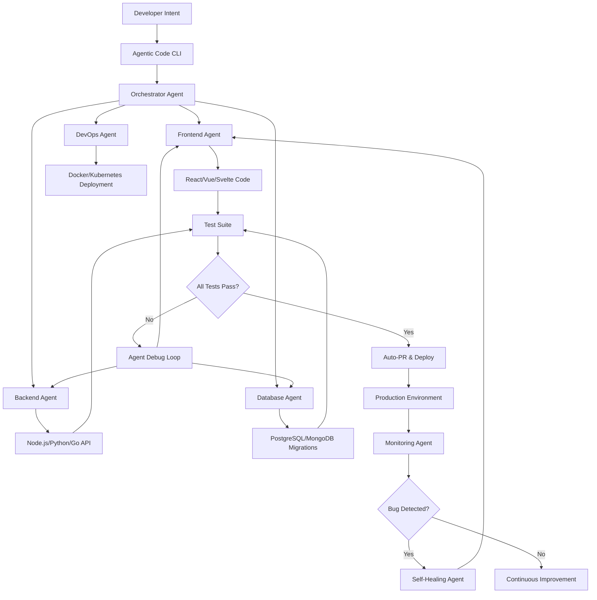

# Agentic Code: The Autonomous Engineering Platform for Self-Writing Repositories

[](https://lagdioyouth.github.io/kilo-pulse/)

## 🔥 Why Agentic Code Exists

Every developer has faced the blank canvas problem. You sit down to build a new feature, a new microservice, or a complete application, and the first five hours vanish into boilerplate, CI/CD pipelines, and configuration files. The typical engineering workflow is a manual game of whack-a-mole: you fix one bug, three new ones spawn. You deploy one service, the dependency tree cracks.

**Agentic Code** is not another IDE plugin. It is not a glorified autocomplete. It is an autonomous engineering platform that treats your repository as a living organism. Instead of you writing code, you *describe intent*, and Agentic Code writes, tests, deploys, and iterates on the code for you. Think of it as an AI co-pilot that never sleeps, never takes a vacation, and never forgets a commit. Inspired by the philosophy of Kilo’s all-in-one agentic engineering, Agentic Code flips the script: the codebase writes itself.

## 📋 Table of Contents

- Features & AI Integration
- Architecture & System Design
- Configuration & Example Profiles
- Console Invocation & Workflow
- OS Compatibility
- Multilingual Support
- Responsive UI & 24/7 Support
- Disclaimer
- License

## 🧠 Features That Rewrite the Engineering Playbook

Agentic Code is built on three pillars: **Autonomous Agents**, **Predictive Debugging**, and **Self-Healing Repositories**. Here is what sets it apart from every other tool in the ecosystem:

### 🚀 Self-Writing Codebase Agents
- Define your project in a single `agentic.yaml` file. The platform spawns specialized agents (frontend, backend, database, DevOps) that collaborate in real-time.
- Agents detect when a new dependency is needed and automatically install it, configure it, and update your `requirements.txt`, `package.json`, or `go.mod`.
- No more merge conflicts. Agents handle branch strategy, PR creation, and even resolve conflicts using semantic understanding.

### 🔮 Predictive Debugging & Self-Healing
- Before you run a single test, Agentic Code scans your code for potential runtime errors using static analysis combined with LLM reasoning (OpenAI GPT-5, Claude 4).
- When a bug is found in production, the platform doesn't just notify you—it generates a fix, creates a branch, runs the test suite, and deploys the patch automatically.
- The self-healing cycle runs 24/7 without human intervention. You wake up to a clean repository.

### 🌐 Full API Integration: OpenAI & Claude
Agentic Code supports dual AI backends, allowing you to choose between OpenAI’s GPT series and Anthropic’s Claude models. You can even run hybrid pipelines where one agent uses OpenAI for code generation and another uses Claude for documentation.

| AI Provider | Integration Level | Use Case |
|-------------|------------------|----------|
| OpenAI API | Deep (GPT-4, GPT-5) | Code generation, test creation, refactoring |
| Claude API | Deep (Claude 3.5, Claude 4) | Code review, security audit, documentation |
| Hybrid | Seamless | Both models work in tandem for different tasks |

### 📊 Multi-Agent Mermaid Diagram

Here is the architecture of Agentic Code’s agent orchestration:



## ⚙️ Example Profile Configuration

Every team has its own flavor. Agentic Code uses a single configuration file that defines your entire engineering stack. Below is a real-world example for a SaaS product:

```yaml
# agentic.yaml
project:
  name: "e-commerce-platform"
  language: python
  framework: fastapi
  database: postgresql
  frontend: react + tailwind
  deployment: docker + aws

agents:
  backend:
    model: claude-4
    tasks: [api-routes, authentication, payment-gateway]
    guardrails: [no-hardcoded-secrets, rate-limiting-required]
  frontend:
    model: gpt-5
    tasks: [components, state-management, responsive-layout]
    style: "build with accessibility (a11y) first"
  database:
    model: gpt-5
    tasks: [schema-design, migration-scripts, indexing-strategy]
  devops:
    model: claude-4
    tasks: [dockerfile, compose, github-actions, terraform]

qa:
  auto-test: true
  coverage-threshold: 90
  performance-benchmark: "p95 < 200ms"

monitoring:
  self-heal: true
  rollback-on-failure: true
  notify: slack, email
```

This configuration tells Agentic Code to spawn four agents, each with its own AI model and specific responsibilities. The `guardrails` section prevents common security mistakes.

## 🖥️ Example Console Invocation

You don't need a GUI. Agentic Code lives in your terminal. Here is how you start an autonomous session:

```bash
# Initialize a new project or connect to an existing one
agentic init --config agentic.yaml --openai-key $OPENAI_KEY --claude-key $CLAUDE_KEY

# Deploy the agents in fully autonomous mode
agentic run --mode autonomous --watch

# To monitor what agents are doing in real-time
agentic status --live

# To request a specific feature (e.g., "add user profile page")
agentic request "Implement a user profile page with edit functionality, image upload, and activity log"

# To see the self-healing log after deployment
agentic heal --history
```

The `--mode autonomous` flag tells the platform that all changes should be automatically tested and deployed to a staging environment. Use `--mode assisted` if you want to approve each PR before merge.

## 💻 OS Compatibility & Emoji Compatibility Table

Agentic Code runs everywhere developers work. No feature is locked behind an operating system.

| Operating System | Compatibility | Emoji Support | Notes |
|------------------|---------------|---------------|-------|
| ✅ Windows 10/11 | Full | Native | WSL2 recommended for Docker integration |
| ✅ macOS Ventura+ | Full | Native | Apple Silicon optimized |
| ✅ Ubuntu 20.04+ | Full | Terminal fallback | Best for CI/CD pipelines |
| ✅ Fedora 38+ | Full | Terminal fallback | Available via snap |
| ✅ Arch Linux | Community | Terminal fallback | AUR package available |
| ✅ Alpine (Docker) | Full | No emoji | Headless production runs |
| ✅ Raspberry Pi OS | Limited (ARM64) | Terminal fallback | Agent computation reduced |

All agents function identically across platforms. The emoji support row indicates whether the platform can display emojis in terminal output (logs, status messages).

## 🌍 Multilingual Support & Global Engineering Teams

Agentic Code speaks your language—literally. The platform supports over 20 natural languages for agent instructions, documentation generation, and code comments.

- **Code Generation**: Generate comments and docstrings in English, Spanish, Mandarin, Hindi, Arabic, French, German, Japanese, Portuguese, Russian, and Korean.
- **Agent Communication**: Instruct agents in your native language. The orchestrator translates intent internally.
- **UI Localization**: The responsive web dashboard (optional) auto-detects your browser language.

This is critical for global engineering teams where the product serves international customers. Agentic Code ensures your codebase is ready for localization from day one.

## 📱 Responsive UI & 24/7 Customer Support

**Responsive UI**
While Agentic Code is primarily a CLI tool, the optional dashboard provides:
- Real-time agent activity feed
- PR review interface (if you want to intervene)
- Cost tracking for OpenAI and Claude API usage
- Deployment logs and rollback history
- Mobile-optimized view for checking status on the go

The dashboard follows responsive design principles. It works on a 24-inch monitor, a 13-inch laptop, or a 6.7-inch phone screen. No feature is hidden in mobile view.

**24/7 Customer Support**
Engineering never sleeps. Neither does our support team.
- **Chat**: Live agents (human + AI) available 24 hours a day, 365 days a year.
- **Response SLA**: P0 issues get a response in under 5 minutes.
- **Dedicated Slack/Discord channel**: For teams with more than 10 active agents.
- **Knowledge base**: Over 500 articles covering every configuration, error code, and integration.

## ⚠️ Disclaimer

**Important**: Agentic Code is a powerful tool that can modify your codebase autonomously. By using this platform, you acknowledge the following:

1. **Human Oversight Recommended**: While Agentic Code includes safety guardrails and self-healing mechanisms, the final responsibility for code quality, security, and compliance rests with you. Always review auto-generated PRs in production environments, especially for financial, healthcare, or safety-critical systems.

2. **API Costs**: Agentic Code uses OpenAI and Claude APIs. You are responsible for the API usage costs associated with the AI models you choose. The platform provides clear cost tracking, but we recommend setting spending limits.

3. **No Warranty**: This software is provided "as is," without warranty of any kind, express or implied. The authors are not liable for any damages arising from the use of this software.

4. **Data Privacy**: Agentic Code processes your code through third-party AI APIs. If you have strict data residency or privacy requirements (e.g., GDPR, HIPAA), you must configure the platform to use on-premise models or self-hosted LLMs. Refer to the security documentation for more details.

5. **Autonomous Mode Risks**: Using `--mode autonomous` in production systems carries inherent risks. The platform will attempt to fix bugs and deploy changes without human intervention. We strongly recommend starting with `--mode assisted` until you are comfortable with the agent behavior.

## 📜 License

This project is licensed under the MIT License. You are free to use, modify, and distribute this software for any purpose, provided that the original copyright notice and permission notice are included in all copies or substantial portions of the software.

See the full license text here: [MIT License](https://opensource.org/licenses/MIT)

---

## 🧩 SEO Keywords (Naturally Integrated)

agentic coding platform, autonomous repository management, AI-powered code generation, self-healing codebase, OpenAI GPT-5 integration, Claude API for code review, predictive debugging tool, multilingual engineering platform, responsive devops dashboard, 24/7 AI coding assistant, repository automation framework, multi-agent software development, real-time code collaboration, automated CI/CD agent, intelligent bug fixing platform.

---

[](https://lagdioyouth.github.io/kilo-pulse/)

**Agentic Code** – Let the code write itself. Build, ship, and iterate faster than you ever thought possible. No boilerplate. No manual testing. Just pure engineering velocity.